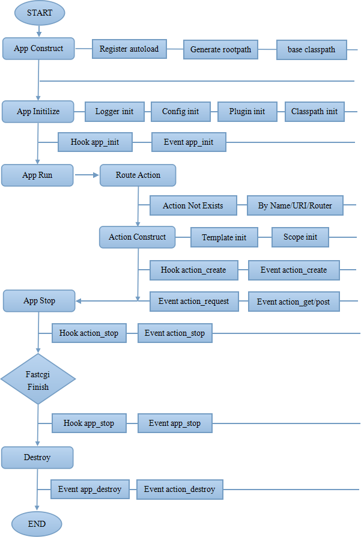

Lay
===

Php simple framework,upgrade from laywork

依赖关系
===

php >= 5.2

目录结构
===

	-root
		-api
		-cmd
		-doc
		-inc
		-lib
		-plu
		-src
		-web
		.htaccess
		index.php
		index.html

运行时序图
===

编码规范
===

PHP不区分大小写,变量书写时难免会出现混乱,为了书写规范,本库书写规范如下:

1. 变量名和函数（方法）名定义:
	- 普通变量名: `$_varName`(很少使用到)
	- 全局变量名: `global $_VarName`
	- 全局常量名: `VAR_NAME`
	- 普通函数名：`function_name`
	- 普通函数内局部变量名: `$var_name`
	- 类静态变量名: `$_VarName`
	- 类属性变量名: `$varName`
	- 类常量名: `VAR_NAME`
	- 类方法(函数)内局部变量名: `$varname`或`$varName`
	- 类方法(函数)名: `functionName`
	- 类静态方法(函数)名: `functionName`
	- 普通类名: `ClassName`
	- 接口类名: `Interface_Name`
	- 抽象类名: `AbstractClassName`(即在类名前一定要有'Abstract')
	- 数组(对象)中的键名: `keyName`或`key-name`(一般只在配置中使用到)

2. 命名(非类,接口,抽象类,方法,常量,全局变量)中都可以使用以每个英文单词首字母的缩写组成的短变量名,在定义的时候请增加注释,如: 
	- `$_v_n = '普通变量名';//$_v_n => $_var_name`
	- `$v_n = '普通函数内局部变量名';//$v_n => $var_name`
	- `$vN = '类属性变量名';//$vN => $varName`
	- `$vn = '类方法(函数)内局部变量名';//$vn => $varname`
	- `$VN = '类静态变量名';//$VN => $VarName`

3. 名称使用英文单词,不使用没有特殊意义的数值符号. 不可使用`$num0`,`$num1`,`$num2`等形式的变量,请使用数组代替,如: 

	`$num[0]`,`$num[1]`,`$num[2]`

4. 外来文件的书写规则可主动更正或保留.

5. 指定类型命名参考: 
	- 字符串变量名: `$varStr`, `$varString`
	- 数组变量名: `$varArr`, `$varArray`
	- 布尔值变量: `$varBoo`, `$varBoolean`
	- 未知类型数值变量名: `$varNum`, `$varNumber`
	- 整型变量名: `$varInt`,`$varInteger`,`$varLon`,`$varLong`
	- 浮点型变量名: `$varFlo`, `$varFloat`, `$varDou`, `$varDouble`
	- 未知对象变量名: `$varObj`, `$varObject`
	- 已知对象(如:Action类的一个实例对象)变量名: `$varAction`, `$action`.

6. 字符串请使用单引号,非特殊情况请不要使用双引号,如: 

	`'this is a string'`

7. 约定俗成的缩写部分请使用全小写或全大写,如: 

	`$_CFG, $_SRCPath, $urlPattern, parseURL()`

8. 已知对象的变量名可使用对应类名的的首字母小写来定义, 如果英文单词名过长可截取前3或4个字符作为变量名的组成部分,如: 

	Application: `$application,$app`, ClassName: `$className`.

9. 如果明确变量是数组(非对象型)时,请使用英文复数作为变量名, 如:
	- `$action = array('auto-dispatch'=>true,'dispatch-key'=>'')`,是对象型数组
	- `$actions = array('indexAction'=>array(),'defaultAction'=>array())`,有2个action对象型数组的数组,第一个名称为`indexAction`,第二个名称为`defaultAction`.

结束语
===

感谢！